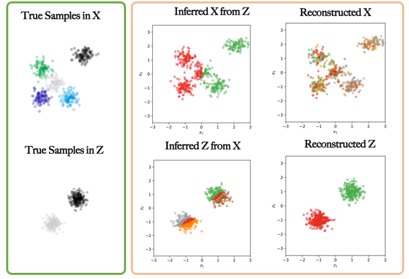

DiscoGAN
=========================================

Tensorflow implementation of [Learning to Discover Cross-Domain Relations
with Generative Adversarial Networks](https://arxiv.org/pdf/1703.05192.pdf). 

Prerequisites
-------------
   - Python 3.5
   - Tensorflow 1.0
   - Others
   
### 5-GMM to 2-GMM

The demo is tested a toy dataset, with domain X as 5-component GMM, and domain Z as 2-component GMM. It can be easily extended to other GMM settings, and real dataset.

To train:

    $ python DiscoGAN_main.py
    
The reuslts:    

